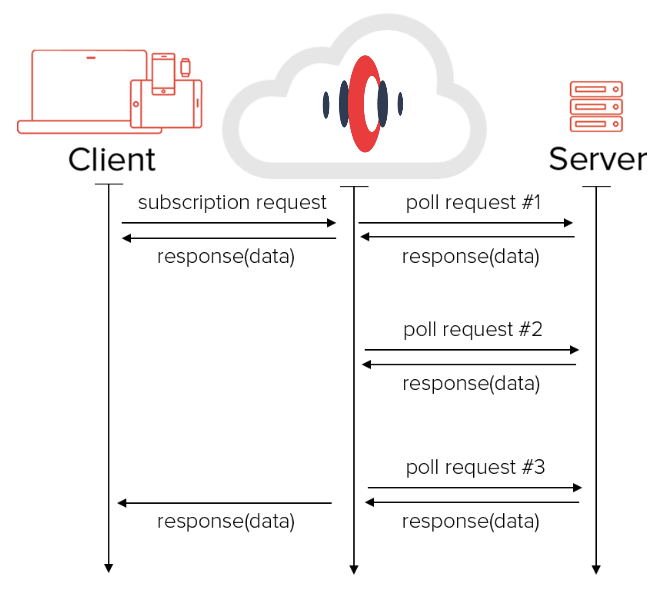

name: dblue
class: bg-dark-blue, center, middle
layout: true

<span class="twitter_id">@leggetter</span>

---

name: green
class: green-template, center, middle
layout: true

<span class="twitter_id">@leggetter</span>

---

name: lblue
layout: true
class: bg-light, center, middle

<span class="twitter_id">@leggetter</span>

---

name: black
layout: true
class: bg-black, center, middle

<span class="twitter_id">@leggetter</span>

---

name: white
layout: true
class: bg-white, center, middle, white-text

<span class="twitter_id">@leggetter</span>

---

template: white
class: hide-slide-numbers hide-twitter
background-image: url(./img/devweek.png)

---

template: dblue
class: title

* <span class="speaker">Phil @leggetter</span>
* <span class="speaker-job-title">Head of Developer Relations</span>
* <span class="speaker-nexmo-logo"></span>

???

* Real-time since 2001
* SDKs
* Apps
* Evangelism

---

template: white
class: bg-contain
background-image: url(./img/nexmo/what-nexmo-offers.png)

???

---

class: fixed-width-list

## What we'll cover

1. Why Real-Time?
2. Common Real-Time Use Cases
3. What are your options?
  * How do you choose?
  * .NET examples
  * Pros & Cons
4. The Future of Real-Time

---

template: dblue

# When do we need Realtime?

---

class: bg-cover trans-h
background-image: url(./img/warp-core.gif)

## WCaaS

--

### Data: Is there a timely nature to the data?

???
- Is there a value or need to get the data quickly?
- Firm or Soft deadline
- Maintain Context ??

---

class: bg-cover trans-h top
background-image: url(./img/game-latency.gif)

--

### User Experience: Is there a timely nature to the experience?

???
- Anything with human-to-human interaction
- Some interactions with systems
- Frustration at high latency on a voice call

---

class: fixed-width-list

## Realtime is required when there's a *Need* or *Demand* for:

* Up to date information
* Interaction to maintain engagement (UX)

---

class: top

<br /><br />

# These aren't new *Needs* or *Demands*

## But...

--

# The Internet

???

But we had a constraint... The Internet

---

## Internet

> a global computer network providing a variety of information and communication facilities, consisting of interconnected networks using standardized communication protocols.

???

* Beyond web pages and Browsers
* Beyond just HTTP and hyperlinks
* Companies like Nexmo bridge Internet and Telephony

---

background-image: url(img/internet.png)
class: bg-contain

???
* long strived to build real-time Internet applications
* Arrow -> Effort required to innovate

---

background-image: url(img/plato-talkomatic.png)
class: bg-contain

???
Talkomatic realtime Chat - created back in 1973

---

background-image: url(img/internet-http.png)

???

---

## HTTP was better. But many wanted more.

---

background-image: url(img/yahoo-chat.png)

???
Yahoo! Web chat. Looks like a Java Applet.

---

background-image:url(img/reuters-kobra.png)
class: bg-contain

???
Financial Data. Also Java.

---

background-image: url(img/legacy-finance-web.gif)
class: bg-contain

---

class: fixed-width-list top

## HTTP + Browsers were restrictive

* HTTP - request/response paradigm
* Keeping persistent HTTP connections alive
* No cross-browser `XMLHttpRequest`
* 2 connection limit
* No browser cross origin support
* General cross browser incompatibilities
--

* So we **HACKED!** Java Applets, Flash, HTTP Hacks

???

With the browser ...
Don't go into detail

---

template: dblue

# Then Real-Time Went Mainstream

???

---

background-image: url(img/follow-magnified.png)
class: trans-h, top

# Social

???
Social Demonstrated Value:
- Twitter
- Facebook
- Skype
- Other chat solutions

- Demand and Need for update to date info
- Demand and Need for interaction

- The FOLLOW & FRIEND buttons - we know who's interested.

---

class: fixed-width-list

## Technology Advancements

* Memory & CPU speed and cost
* The Cloud
* Browser standardisation & enhancements
* Any client can use the standards

???

---

class: bg-contain
background-image:url(img/internet-http-es-ws.png)

???

Close to innovation

---

## **MASSIVE** Increase in Internet Usage

---

class: unstyled-links top fixed-width-list

## Internet Usage (per day)

* **[200 billion emails][email-stat]**
--

* [7 million blog posts written][wordpress-stat]<sup>†</sup>
* [500 million tweets][twitter-stat]
* **[30 billion WhatsApp messages](http://www.techcityuk.com/blog/2015/10/startup-guide-to-cloud-communications/)**
--

* [55 million Facebook status updates][facebook-stat]
* [5 billion Google+ +1's][googleplus-stat]
* [60 million Instagram photos posted][instagram-stat]
* [2 billion minutes spent on Skype][skype-stat]
* [33 million hours of Netflix watched][netflix-stat]
* **[750 million hours of YouTube watched][youtube-stat]**

[email-stat]:http://www.radicati.com/wp/wp-content/uploads/2013/04/Email-Statistics-Report-2013-2017-Executive-Summary.pdf
[twitter-stat]:http://abcnews.go.com/Business/twitter-ipo-filing-reveals-500-million-tweets-day/story?id=20460493
[facebook-stat]:http://blog.kissmetrics.com/facebook-statistics/
[googleplus-stat]:http://www.mediabistro.com/alltwitter/social-media-stats-2012_b30651
[wordpress-stat]:http://wordpress.com/stats/posting/
[instagram-stat]:http://instagram.com/press/
[youtube-stat]:http://www.statisticbrain.com/youtube-statistics/
[netflix-stat]:http://blog.netflix.com/2014/01/new-isp-performance-data-for-december.html
[skype-stat]:http://blogs.skype.com/2013/04/03/thanks-for-making-skype-a-part-of-your-daily-lives-2-billion-minutes-a-day/

???
- What are the main (work safe) uses for the Internet each day?
- † 41.5 million posts in April = 1.38 million per day. Assuming WordPress.com have 20% of the market; 1.38 * 5 = 6.9 million posts on all blogging platforms.
- †† 3.25 billion hours each month

---

class: bg-white
background-image: url(./img/time-on-internet.png)

???

Mary Meeker, Kliener Perkins, Internet Trends 2015

---

template: dblue
class: bg-dark-blue, h1-big

# Common Real-Time Use Cases

???

* Here are some examples of apps...

---

class: em-text, bg-cover, trans-h, bottom
background-image: url(./img/twitter-notifications.gif)

# Notifications & Activity Streams

???

Notifications

* Something has happened /Changed
* Alert - do something

Activity Streams: 

* a stream of activity: past & new
* synonymous with social apps
  * Twitter, Facebook, Google+
  * News, Sports

---

class: bg-cover, em-text, trans-h, bg-white, bottom
background-image: url(./img/lequipe-football.png)

# Data Visualizations

---

class: bg-video, trans-h, em-text, bottom

# Chat

<video id="video" autoplay="true" loop="true">
  <source src="./img/pie.mp4" type="video/mp4">
</video>

???

* The 101 of realtime
* An interactive experience
* Real-time matters

---

class: bg-white
background-image: url(./img/messaging-apps.png)

---

class: trans-h, bg-cover, bottom
background-image: url(./img/uber.jpg)

# Real-Time Location Tracking

---

class: trans-h, bottom, bg-cover
background-image: url(./img/gdocs-collaboration.png)

# Multi-User Collaboration

???

* Google Apps
* Cloud 9
* TODO: other

---

class: trans-h top
background-image: url(./img/talky-io.png)

## WebRTC Powered AV Chat

---

class: top


--

# Users expect a real-time UX

--

# Without a real-time UX your app appears broken

---

template: dblue
class: h1-big

# Real-time Web Apps & .NET<br />What are your options?

---

class: h1-big

# 7 Factors to Consider

---

template: dblue

# 1. Should you keep on polling?

---

class: top

## Polling Calculations

Scenario

1. Site average of 10,000 Users
--

2. Over 1 Hour, with a 10 second polling interval
--

3. Requests from pages load + HTML, CSS, JS, Images for 10k users = 50,000
--

4. Poll requests per user/minute = (60 / 10) = 6
--

5. Poll requests per user/hour = (6 * 60) = 360
--

6. Poll requests site wide per hour = (360 * 10,000) = 3,600,000
--


With polling the site would need to handle **3.65 Million requests** per hour

Or **50k HTTP requests + maintain 10k persistent connections**?

---

## Quick Win solutions

.left[* Cache - clients keep polling
* Push Proxy solutions
  * [fanout.io](https://fanout.io)
  * [streamdata.io](http://streamdata.io)
]



---

template: dblue
class: h1-big, bg-cover, em-text
background-image: url(./img/falkirk-wheel.gif)

# 2. Use an existing solution

## Don't reinvent the wheel

<small>Unless you've a unique use case</small>

---

class: fixed-width-list top

## Why use an existing solution?

* Connection fallback/upgrade hacks still required
  * WebSocket: **91%** of connections
  * HTTP fallback: **9%** of connections
--

* Support/Community
--

* Maintenance
--

* Future features
--

* Scaling

---

class: bg-white, bg-cover trans-h

background-image: url(./img/real-time-tech-choices.gif)

--

## <a style="color:white; text-decoration: none;" href="https://j.mp/realtime-tech-guide">j.mp/realtime-tech-guide</a>

---

template: dblue
class: bg-cover, trans-h, top
background-image: url(./img/choose-a-lang.gif)

# 3. Use languages you're comfortable with

--
background-image: none;

---

## Solutions by language

* **PHP**: Ratchet, dNode-php
* **Java**: Netty, Jetty
* **JavaScript (Node.JS)**: Faye, Socket.IO (Engine.IO), Primus.io
* **.NET (C#)**: SignalR, XSockets
* **Python**: Lots of options built on Tornado
* **Ruby**: em-websocket, Faye
* *Language agnostic*: most hosted services

---

template: dblue
class: h1-big, trans-h, bg-contain
background-image: url(./img/windows-apple-android.jpg)

# 4. Mobile Friendly?

---

class: top fixed-width-list

## Mobile Friendly

* Only some have mobile libraries
--

* How much data are you sending?
--

* SSL required on 3/4G networks

---

template: dblue
class: h1-big top

# 5. Application/Solution<br />Communication Patterns

--

How does the client/server &amp; client/client communicate

???

Let me clarify this with code.

---

class: trans-h bottom
background-image: url(./img/internet-http-es-ws-msg.png)

# Simple Messaging

???

* Basic things
* Simple message or even no payload

---

class: full-video top trans-h

<h1 style="position: relative; z-index: 1000000;">Internet ^5 Machine</h1>

<video  poster="./video/internet-high-5-machine.png" width="90%" preload="none" controls>
  <!-- .element: class="fragment fade-in" data-fragment-index="1" -->
  <source src="./video/640/internet-high-5-machine-640.mp4" type="video/mp4">
  <source src="./video/640/internet-high-5-machine-640.webm" type="video/webm">
  <p>Please download and watch our <a href="./video/640/internet-high-5-machine-640.mp4">Internet ^5 clip</a></p>
</video>

--
play_video:

???
Russell Thomas and Syd Lawrence

---

class: code-reveal top wide larger-code

#### Simple Messaging

```js
// client

var ws = new WebSocket('wss://localhost/');
```
--
```js
ws.onmessage = function(evt) {
  var data = JSON.parse(evt.data);
```
--
```js
  // ^5  
  performHighFive();
};
```
--

<hr />

```js
// server

server.on('connection', function(socket){
```
--
```js
  socket.send(JSON.stringify({action: 'high-5'}));
});
```

???

* Simplistic pattern
* Similar to WebHooks

---

class: code-reveal top wide larger-code

#### Simple Messaging

```cs
using Nexmo.Api;

// SMS
var results = SMS.Send(new SMS.SMSRequest
            {
                from = "15555551212",
                to = "17775551212",
                text = "this is a test"
            });
            
// Voice
var result = Voice.TextToSpeech(new Voice.TextToSpeechCallCommand
            {
                to = "17775551212",
                from = "15555551212",
                text = "Hello from Nexmo"
            });
```

---

class: trans-h bottom
background-image: url(./img/internet-http-es-ws-msg-pubsub.png)

# PubSub

---

class: bg-contain
background-image: url(./img/twitter-notifications.gif)

???

* 2 channels
  * leggetter status updates
  * leggetter direct message notifications

---

class: code-reveal top wide larger-code

#### PubSub

```js
// client

var client = new Faye.Client('http://localhost:8000/faye');
```
--
```js
client.subscribe('/leggetter-updates', function(data) {
```
--
```js
  console.log(data.text);
});
```
--
```js
client.subscribe('/leggetter-dm-notifications', function(data) {
  console.log(data.count);
});
```
--
<hr />

```js
// server

server.publish('/leggetter-updates', {text: 'Hello DevWeek!'});
```
--

```js
server.publish('/leggetter-dm-notifications', {count: 2});
```

---

class: bottom trans-h
background-image: url(./img/internet-http-es-ws-msg-pubsub-evented.png)

# Evented PubSub

---

class: long wide code-reveal top larger-code

#### Evented PubSub

```js
// client

var updates = io('/leggetter-updates');
```
--
```js
updates.on('created', function (data) {
  // Add activity to UI
});
```
--
```js
updates.on('updated', function(data) {
  // Update activity
});
updates.on('deleted', function(data) {
  // Remove activity
});
```
--

<hr />

```js
// server

var io = require('socket.io')();
var updates = io.of('/leggetter-updates');
```

--
```js
updates.emit('created', {text: 'PubSub Rocks!', id: 1});
```
--
```js
updates.emit('updated', {text: 'Evented PubSub Rocks!', id: 1});
updates.emit('deleted', {id: 1});
```

---

## PubSub vs. Evented PubSub

???

* Let's use Chat to compare PubSub & Evented PubSub

---

class: bg-contain
background-image: url(./img/slack-ui.png)

---

class: bg-contain
background-image: url(./img/slack-ui-channels.png)

---

class: long larger-code top code-reveal

PubSub

```js
client.subscribe('devexp-channel', function(data) {
  if(data.eventType === 'chat-message') {
    addMessage(data.message);
  }
```
--
```js
  else if(data.eventType === 'channel-purposed-changed') {
    updateRoomTitle(data.purpose);
  }
  else if(/* and so on */) {
  }
})
```

--

Evented PubSub

```js
var devexp = io('/devexp-channel');
devexp.on('chat-message', addMessage);
devexp.on('channel-purposed-changed', updateChannelPurpose);
```
--
```js
devexp.on('current-topic-changed', updateChannelTopic);
devexp.on('user-online', userOnline);
devexp.on('user-offline', userOffline);
```

---

class: bottom trans-h
background-image: url(./img/internet-http-es-ws-msg-pubsub-ds.png)

# DataSync

---

background-image: url(./img/gdocs-collaboration.png)

---

class: code-reveal top larger-code long wide

#### Data Sync

```js
// client

var ref = new Firebase("https://app.firebaseio.com/doc1/lines");
```
--
```js

ref.on('child_added', function(childSnapshot, prevChildKey) {
  // code to handle new child.
});
```
--

```js

ref.on('child_changed', function(childSnapshot, prevChildKey) {
  // code to handle child data changes.
});

```
--

```js

ref.on('child_removed', function(oldChildSnapshot) {
  // code to handle child removal.
});
```
--

```js

ref.push({ 'editor_id': 'leggetter', 'text': 'Nexmo Rocks!' });
```

--

Framework handles updates to other clients

???

* Manipulating collection of data
* Not dealing with Messages

---

class: bottom trans-h
background-image: url(./img/internet-http-es-ws-msg-pubsub-ds-rmi.png)

# RMI (aka RPC)

---

background-image: url(./img/fx-motif.png)

???
- Open a trade
- Get open ack
- Wait for it to become executable
- You can withdraw/it can expire, or you can execute
- Trade is then confirmed
- Confirm ack / expired
- Easier to be calling methods on objects? RMI
- What is RMI?
- *This actually uses a PubSub framework**

---

class: top code-reveal long wide larger-code

#### RMI

```js
// client
var chat = $.connection.chatHub;
```
--

```js

chat.client.broadcastMessage = function (name, message) {
  // handle message
};
```
--

```js

chat.server.send( 'me', 'hello world' );
```
--
```js

$.connection.hub.start(); // async
```
--
<hr />

```csharp
// server
public class ChatHub : Hub
{
```
--

```csharp
  public void Send(string name, string message)
  {
```
--

```csharp
    // Call the broadcastMessage method to update clients.
    Clients.All.broadcastMessage(name, message);
  }
}
```

---

class: bg-contain
background-image: url(./img/internet-http-es-ws-msg-pubsub-rmi-ds.png)

---

class: bg-white
background-image: url(./img/rtw-tech-decision-matrix-on-axis-v2.jpg)

---

class: bg-white
background-image: url(./img/rtw-tech-decision-matrix-usecases-black-v2.png)

---

class: bg-white
background-image: url(./img/rtw-tech-decision-matrix-apps-black-v2.png)

???
  
---

class: bg-white
background-image: url(./img/rtw-tech-decision-matrix-solutions-v2.png)

???
  
* SockJS - focus on simple connections
* Some solutions offer PubSub and data sync
* Dropbox - offer simple DataStore API
* Only know a few RMI options
* New solutions: Meteor, DerbyJS, SailsJS - maybe a new category for these?

---

template: dblue
class: h1-big

# 6. Deployment & Architecture Considerations

---

# Code

* https://github.com/leggetter/realtime-dotnet-examples
* Short link: http://j.mp/rt-dotnet-ex

---

class: bottom
background-image: url(./img/realtime-web-stack-tight-integration-self-hosted.png)

### Self Hosted <small>(Tightly Coupled)</small>

???

* Less initial overhead - quick Integration
* As project grows complexity increases
* Updating request/response cycle may impact realtime functionality and vise-versa
* Likely that the web server is handling load of both standard HTTP and realtime i.e. WebSocket, Server-Sent Events, HTTP fallbacks

---

class: fixed-width-list

## .NET Self-Hosted Real-Time options

* [SignalR](http://www.asp.net/signalr)
* [XSockets](http://xsockets.net)

???

* On my radar
* Are there more?
* XSockets
  * Uffe Björklund
  * Magnus Thor

---

template: green
class: bottom, trans-h
background-image: url(./img/realtime-web-stack-tight-integration-self-hosted-signalr.png)

--

### Self-Hosted Demo 1: ASP.NET + SignalR <small>(Tightly Coupled)</small>

???

---

## What we'll look at:

* `References\Microsoft.AspNet.SignalR.*`
* `Scripts\jquery.signalR*.js`
* `App_Start\SignalRStartup.cs`
* `Controllers\HomeController.cs`
* `Hubs\ChatHub.cs`
* `Views\Home\SignalR.cshtml`
* `Script\chat\SignalRChat.js`

---

## Self-Hosted Demo 1: Pro & Cons

.left[
**Pros**

* .NET
* Simple integration
* MS Supported
* *jQuery Dependency*
]

.right[
**Cons**

* Tightly coupled
* RMI only
* Self-Scaling
* Scaling (realtime + HTTP)
]

---

template: green
class: bottom, trans-h
background-image: url(./img/realtime-web-stack-tight-integration-self-hosted-xsockets.png)

--

### Self-Hosted Demo 2: ASP.NET + XSockets <small>(Tightly Coupled)</small>

???

---

## What we'll look at:

* `References\XSockets.*`
* `App_Start\XSocketsStartup.cs`
* `Controllers\HomeController.cs`
* `XSockets\ChatController.cs`
* `Views\Home\XSockets.cshtml`
* `Scripts\XSockets.latest.js`
* `Script\chat\XSocketsChat.cs`

---

## Self-Hosted Demo 2: Pro & Cons

.left[
**Pros**

* .NET
* Simple integration
* Communication patterns
  * PubSub/Evented
  * RMI
* *Licensed*
]

.right[
**Cons**

* Tightly coupled
* Self-Scaling
* Scaling (realtime + HTTP)
* *Licensed*
]

---

class: bottom, trans-h
background-image: url(./img/realtime-web-stack-integration-self-hosted.png)

### Self-Hosted: .NET + Message Queue <small>(Loosely Coupled)</small>

---

class: img-contain top

[](https://code.msdn.microsoft.com/windowsapps/SignalR-self-hosted-in-6ff7e6c3)

---

## Self-Hosted: .NET + Message Queue - Pro & Cons

.left[
**Pros**

* .NET
* Maps well to PubSub
* Loosely coupled
* Could use another runtime
]

.right[
**Cons**

* How does it fit with RMI/SignalR?
* Multiple components
* Self-scaling
* Queue routing questions
* In: HTTP. Out: WebSocket
]

---

template: green
class: bottom, trans-h demo-splash
background-image: url(./img/realtime-web-stack-integration-self-hosted-msgq-faye.png)

--

### Self-Hosted: ASP.NET + Faye<br /><small>(Loosely Coupled)

---

class: wide

## Self-Hosted + Faye: Pros & Cons

.left[
**Pros**

* PubSub
* Connection fallback
* Redis Queue support
* Simple integration
]

.right[
**Cons**

* Not .NET(?)
* You need to scale
]

---

class: fixed-width-list

## .NET Hosted Real-Time options

* [Ably](https://ably.io)
* [Firebase](https://firebase.com)
* [Fanout](https://fanout.io)
* [PubNub](https://pubnub.com)
* [Pusher](https://pusher.com)
* [Realtime.co](https://realtime.co)
* [Syncano](https://www.syncano.io/)

???

---

template: green
class: bottom, trans-h
background-image: url(./img/realtime-web-stack-integration-hosted-pusher.png)

--

### Hosted Demo: Pusher

---

## What we'll look at:

* `References\PusherServer`
* `Controllers\HomeController.cs`
* `Views\Home\Pusher.cshtml`
* `Script\chat\PusherChat.js`
* [Pusher Debug Console](https://dashboard.pusher.com/apps/97748/console)

---

## Hosted - Pros & Cons


.left[
**Pros**

* Simple & powerful
* Instantly scalable
* Managed & dedicated
* Direct integration. No overhead.
]

.right[
**Cons**

* 3rd party reliance
* Difficult to influence functionality
]

???

* Load-balancing connections
* Maintaining state of connections
* Synchronising data between nodes
* Mapping connections to users?
* Dedicated hosted service will offer :
  * Make things easier and faster  
  * Reduce scaling complexities
  * Natural loose coupling via an API
* Where is your value?
  * Features v Infrastructure
  
---

class: top

# Why use a hosted service?

Scenario

1. Site average of 10,000 Users
--

2. Over 1 Hour, no polling
--

3. Requests from pages load + HTML, CSS, JS, Images for 10k users = 50,000
--

4. That's it! Total: 50,000
--


Your servers handle **50k requests per hour instead of 3.6M**

You offload the polling or persistent connections to the service

---

template: dblue

# 7. Self-Hosted v Hosted

## "Build vs. Buy"

---

class: bg-cover top trans-h
background-image: url(./img/build-vs-buy.png)

## Build vs. Buy - Costs

<a style="position: absolute; top: 2%;" href="https://baremetrics.com/calculator">baremetrics.com/calculator</a>

---

template: dblue

## How do you choose?
### 7 Realtime Framework Considerations

1. Should you keep on polling?
2. Use an Existing Solution
3. Use a language you're comfortable with
4. Do you need native mobile support?
5. Simple Messaging, PubSub/Evented, RMI or DataSync
6. Architectural considerations
7. Hosted v Self-Hosted (Build vs. Buy)

---

template: dblue

# Future

---

class: fixed-width-list

## Network Infrastructure & Protocols

* Reliability
* Speed
* Beyond HTTP
* HTTP2

---

## Communication Pattern Protocol Standardisation

.left[
* [Bayeux](http://svn.cometd.org/trunk/bayeux/bayeux.html)
* [DDP](https://www.meteor.com/ddp)
* [dNode](https://github.com/substack/dnode-protocol)
* [EPCP](https://fanout.io/docs/protocols.html#extensible-pubsub-control-protocol-epcp)
* [GRIP](https://fanout.io/docs/protocols.html#generic-realtime-intermediary-protocol-grip)
* [gRPC](http://www.grpc.io/)
]
.right[
* [MQTT](http://docs.oasis-open.org/mqtt/mqtt/v3.1.1/os/mqtt-v3.1.1-os.html)
* [Pusher Protocol](https://pusher.com/docs/pusher_protocol)
* [STOMP](https://stomp.github.io/stomp-specification-1.2.html)
* SignalR Protocol
* [WAMP](http://wamp.ws/) <small>(Web App Messaging Protocol)</small>
* XMPP ([various](http://xmpp.org/xmpp-protocols/rfcs/))
]

???

* The transportation layer is nearly solved

---

background-image: url(./img/internet-http-es-ws-msg-protocols-pubsub-rmi-ds.png)

---

## Real-Time APIs

.left[
* Firebase
* GitHub
* Iron.io
* MailChimp
]
.right[
* MailJet
* PagerDuty
* Nexmo
* SendGrid
]
  
???

* API-focused companies already do this
* Enables expected real-time experiences

---

class: bg-white
background-image: url(./img/apps-with-realtime-apis.png)

???

Apps with real-time APIs

---

class: trans-h
background-image: url(./img/iot-2020.png)

<h2 style="position: absolute; top: 0; right: 0; display: inline;">More "Things"!</h2>

???
- IDC report
- Same report: 7.7 Billion people
- Smart Homes, cars, drones, kids

---

class: trans-h bg-cover bottom
background-image: url(./img/the-physical-web.png)

<h2 style="position: absolute; right: 1%; display: inline-block;">
  <a style="color:white; text-decoration:none;" href="https://www.youtube.com/watch?v=1yaLPRgtlR0&feature=youtu.be">The Physical Web</a>
</h2>

---

template:dblue

# IoT, Apps & Developers

---

template: pink
class: top fixed-width-list

## A **thing** can be any**thing**

--

* Sensors
* Appliances
* Vehicles
* Smart Phones
* Devices (Arduino, Electric Imp, Raspberry Pi etc.)
--

* Servers
* Browsers
* Apps: Native, Web, running anywhere

---

class: fixed-width-list

## The Majority of code we'll write will still be for "Apps"

* Configuring
* Monitoring
* Interacting
* App Logic

---

class: top fixed-width-list

## Real-Time Use Case Evolution

* Notifications & Signalling
* Activity Streams
* Data Viz & Polls
* Chat
* Collaboration
* Multiplayer Games

???

* The use case for real-time have stayed the same for the past 5 years
* The use cases will fundamentally remain the same, but will augment

---

class: trans-h bg-contain bg-white top h-abs-top
background-image: url(./img/notifications-actions.png)

## Notifications/Activity Streams -> Actions

<a style="position: absolute; bottom: 5%; z-index: 100000; color: black" href="https://blog.intercom.io/the-end-of-apps-as-we-know-them/">The end of apps as we know it - Intercom</a>

---

class: bg-white trans-h top bg-contain
background-image: url(./img/google-now-subscriptions.jpg)

## Subscriptions

---

class: bg-white trans-h top
background-image: url(./img/google-now.jpg)

## Personalised Event Streams

---
class: bg-white trans-h top bg-contain
background-image: url(./img/unified-uis.png)

## Unified UIs

---

template: dblue
class: trans-h abs-bottom-h
background-image: url(./img/chat-apps.png)

#### Chat & Bots for Everything <small> and the rise of the `.ai` domain</small>

---

## WeChat


.right[
* 600M MAUs
* 10M integrations
* app-within-an-app model
* taxi, order food, tickets, games etc.
]

???

* We all use chat
* Skype, HipChat, Slack and Google Hangouts

---

class: trans-h bottom
background-image: url(./img/slack-integration.png)

## Chat Integrations

---

## Chat "Virtual Assistants"

.left[
* Siri
* Google Now
]
.right[
* Microsoft Cortana
* Facebook M
]

---

class: bg-contain
background-image: url(./img/ms-bot-framework.png)

---

template: pink

# Chat has evolved. Chat is now a platform!

---

# Multi-Device Experiences

???
Multiple devices involved in the same experience

---

class: full-video

<iframe width="100%" height="80%" src="https://www.youtube.com/embed/1mkShXn_buA?start=1500" frameborder="0" allowfullscreen></iframe>

???
- We confine ourselves to thinking in the singular.
- What if we think in multiples?
- What sort of experiences and uses would that result in?

---

# You need Real-Time!

## There are lots of options.

## Make the choice that's right for you.

## I hope this helps!

---

class: fixed-width-list

# Resources

* [Real-time Tech Guide](http://j.mp/realtime-tech-guide)
* [github.com/leggetter/realtime-dotnet-examples](https://github.com/leggetter/realtime-dotnet-examples)
* [Tools, Tips and Techniques for Developing Real-time Apps](https://www.youtube.com/watch?v=KPEcK4zFuyw)
* [Nexmo](https://www.nexmo.com)

---

template: dblue
class: title

## Real-time Web Apps & .NET</br>What are your options?

### Questions?

* <span class="speaker">Phil @leggetter</span>
* <span class="speaker-job-title">Head of Developer Relations</span>
* <span class="speaker-nexmo-logo"></span>
