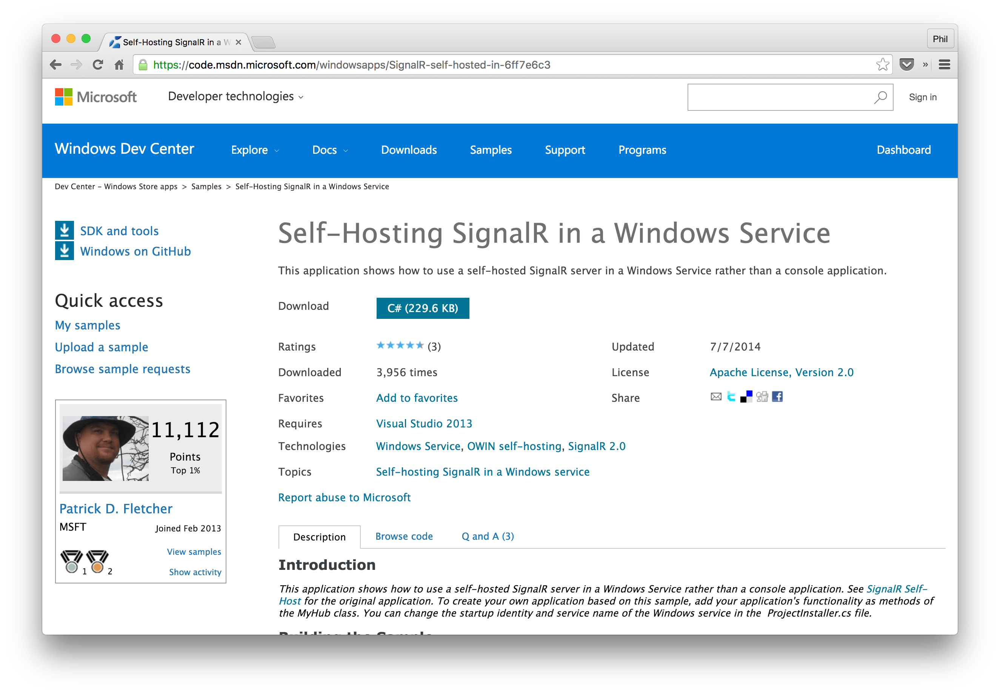

name: dblue
class: bg-dark-blue, center, middle
layout: true

<span class="twitter_id">@leggetter</span>

---

name: pink
layout: true

class: bg-pink, center, middle

<span class="twitter_id">@leggetter</span>

---

name: green
class: green-template, center, middle
layout: true

<span class="twitter_id">@leggetter</span>

---

name: lblue
layout: true
class: bg-light, center, middle

<span class="twitter_id">@leggetter</span>

---

name: white
layout: true
class: bg-white, center, middle, black-text

<span class="twitter_id">@leggetter</span>

---

template: dblue
class: title

# Real-time Web Apps & .NET
# What are your options?

* <span class="speaker">Phil @leggetter</span>
* <span class="speaker-job-title">Head of Developer Relations</span>
* <span class="speaker-pusher-logo"></span>

???

---

class: bg-contain
background-image: url(./img/pusher-white-cloud.png)

---

class: fixed-width-list

## What we'll cover

1. Why Real-Time?
2. What are your options
  * How do you choose?
  * Pros & Cons
3. Example Solutions for .NET

---

template: dblue
class: bg-dark-blue, h1-big

# Why Realtime?

???

* Here are some examples of apps...

---

class: em-text, bg-cover, trans-h, bottom
background-image: url(./img/itv-news-nov-2015.gif)

# Notifications & Signalling

???

* Something has happened
* Changed
* Alert - do something

---

class: bg-cover, em-text, trans-h, bottom
background-image: url(./img/delighted-app.gif)

# Activity Streams

???

* a stream of activity
* things have - and are - happening
* synonymous with social apps
  * Twitter
  * Facebook
  * Google+
  * News
  * Sports

---

class: bg-cover, em-text, trans-h, bg-white, bottom
background-image: url(./img/lequipe-football.png)

# Data Visualizations

---

class: trans-h

<h3 style="position: absolute; top: -7%; left: 2%; z-index: 100;">poll.lab.io/tshirts</h3>

<iframe src="http://poll.lab.io/tshirts/results" width="100%" height="100%"></iframe>

???

Anonymous

---

class: bg-video, trans-h, em-text, bottom

# Chat

<video id="video" autoplay="true" loop="true">
  <source src="./img/pie.mp4" type="video/mp4">
</video>

???

* The 101 of realtime
* An interactive experience
* Real-time matters

---

class: bg-white
background-image: url(./img/messaging-apps.png)

---

class: trans-h, bg-cover, bottom
background-image: url(./img/uber.jpg)

# Real-Time Location Tracking

---

template: lblue
class: trans-h, bottom
background-image: url(./img/atom-pair.gif)

# Multi-User Collaboration

???

* Google Apps
* Cloud 9
* TODO: other

---

template: lblue
class: bg-cover, trans-h, bg-white
background-image: url(./img/lunar-landing.png)

<h3 style="position: absolute; top: 2%; right: 2%; display: inline-block";>
  Multiplayer Games / Real-Time Art
</h3>

---

class: bg-pink, top


--

# Users expect a real-time UX

--

# Without a real-time UX your app appears broken

---

template: dblue
class: h1-big

# Real-time Web Apps & .NET<br />What are your options?

---

class: bg-pink, h1-big

# 6 Factors to Consider

---

template: dblue
class: h1-big, bg-cover, em-text
background-image: url(./img/falkirk-wheel.gif)

# 1. Use an existing solution

## Don't reinvent the wheel

<small>Unless you've a unique use case</small>

---

class: top fixed-width-list

## You can't rely on WebSocket alone

* WebSocket: **91%** of connections
--

* HTTP fallback: **9%** of connections

???

* Who works in Enterprise?
* Who builds clients for mobile devices?
* You need HTTP fallback

---

class: fixed-width-list

## Why use an existing solution?

* Fallback/upgrade hacks still required
* Support/Community
* Maintenance
* Future features
* Scaling

---

class: bg-white, bg-cover trans-h

background-image: url(./img/real-time-tech-choices.gif)

--

## <a style="color:white; text-decoration: none;" href="https://j.mp/realtime-tech-guide">j.mp/realtime-tech-guide</a>

---

template: dblue
class: bg-cover, trans-h, top
background-image: url(./img/choose-a-lang.gif)

# 2. Use languages you're comfortable with

--
background-image: none;

---

## Solutions by language

* **PHP**: Ratchet, dNode-php
* **Java**: Netty, Jetty
* **JavaScript (Node.JS)**: Faye, Socket.IO (Engine.IO), Primus.io
* **.NET (C#)**: SignalR, XSockets
* **Python**: Lots of options built on Tornado
* **Ruby**: em-websocket, Faye
* *Language agnostic*: most hosted services

---

template: dblue
class: h1-big, trans-h, bg-contain
background-image: url(./img/windows-apple-android.jpg)

# 3. Native Mobile Support?

---

class: fixed-width-list

## Native Mobile Support?

* Only some have mobile libraries
* How much data are you sending?
* SSL required on 3/4G networks

---

template: dblue
class: h1-big

# 4. Application/Solution Functionality 

---

class: bg-pink

# Functionality, huh?!

--

# Communication Patterns

???

* It may offer your use case out of the box e.g. chat
* But it's more likely to offer a comms pattern that you can map to your use case

---

# Simple Messaging

---

class: code-reveal, top

Client

```js
var ws = new WebSocket('ws://localhost/');
```
--
```js
ws.onmessage = function(evt) {
  var data = JSON.parse(evt.data);
```
--
```js
  if(data.action) {
    // ^5  
  }
```
--
```js
  else if(data.peerId) {
    var connectTo = data.peerId;
  }
};
```
--

Server

```js
server.on('connection', function(socket){
```
--
```js
  socket.send(JSON.stringify({action: 'high-5'}));
});
```

---

# PubSub

---

class: code-reveal, top

Client

```js
var client = new FayeClient();
```
--

```
client.subscribe( '/chat', function( message ) {
  // Handle Update
} );
```
--

Server

```js
var faye = new faye.NodeAdapter({mount: '/faye', timeout: 45});

var message = {
  text: 'Hello, world!',
  user_name: '@leggetter'
}
faye.getClient().publish( '/chat', message );
```

---

# Evented PubSub

---

class: code-reveal, top

Client

```js
var pusher = new Pusher( APP_KEY );
```
--

```js
var channel = pusher.subscribe( 'chat' );
```
--
```js
channel.bind( 'message', function( data ) {
  // Handle Update
} );
```
--

```
channel.bind( 'message-updated', function( data ) {} );

channel.bind( 'room-name-changed', function( data ) {} );
```

--

Server

```js
var data = new {
  text = "Hello, world!",
  user_name = "@leggetter"
};
pusher.Trigger( "chat", "message", data );
```

---

# Data Synchronisation

---

class: code-reveal, top

```js
var sync = Gun(location.origin + '/gun')

var ref = sync.get('document-1');
```
--
```js

ref.on(function(val) {
  console.log(val)
});
```
--

```js
ref.put({text: 'Hello, DataSync!'}).key('unique-key');
```
--

```js

ref.path('unique-key').set(null);
```

--

Framework handles updates to other clients

???

* Manipulating collection of data
* Not dealing with Messages

---

# RMI/RPC

---

class: top, code-reveal, long

Client

```js
rmi({
```
--
```js
  newMessage: function(message) {
    console.log(message);
  }
})
```
--
```js
.on('remote', function(remote) {
```
--
```js
  remote.sendMessage({text: 'dnode baby!'});
});
```
--

Server

```js
var remotes = [];
rmi({
  sendMessage: function(message) {
```
--
```js
    remotes.forEach(function(remote) {
      remote.newMessage(message);
    });
  }
})
```
--
```js
.on('remote', function(remote) {
  remotes.push(remote);
});
```

---

background-image: url(./img/rtw-tech-decision-matrix-black.png)

---

background-image: url(./img/rtw-tech-decision-matrix-usecases-black.png)

???

---

template: dblue
class: h1-big

# 5. Architecture Considerations

---

template: pink
class: fixed-width-list

## I wanna build a real-time .NET app
or
## I wanna add real-time to an existing .NET app

---

class: bottom
background-image: url(./img/realtime-web-stack-tight-integration-self-hosted.png)

### Self Hosted <small>(Tightly Coupled)</small>

???

* Less initial overhead - quick Integration
* As project grows complexity increases
* Updating request/response cycle may impact realtime functionality and vise-versa
* Likely that the web server is handling load of both standard HTTP and realtime i.e. WebSocket, Server-Sent Events, HTTP fallbacks

---

class: fixed-width-list

## .NET Self-Hosted options

* [SignalR](http://www.asp.net/signalr)
* [XSockets](http://xsockets.net)

???

* On my radar
* Are there more?
* I'll cover these

---

template: green
class: bottom, trans-h
background-image: url(./img/realtime-web-stack-tight-integration-self-hosted-signalr.png)

--

### Self-Hosted Demo 1: ASP.NET + SignalR <small>(Tightly Coupled)</small>

???

---

## Self-Hosted Demo 1 - Pro & Cons

.left[
**Pros**

* .NET
* Simple integration
* MS Supported
* *jQuery Dependency*
]

.right[
**Cons**

* Tightly coupled
* RMI only
* Self-Scaling
* Scaling (realtime + HTTP)
]

---

template: green
class: bottom, trans-h
background-image: url(./img/realtime-web-stack-tight-integration-self-hosted-xsockets.png)

--

### Self-Hosted Demo 2: ASP.NET + XSockets <small>(Tightly Coupled)</small>

???

---

<iframe src="https://uffebjorklund.gitbooks.io/xsockets-net-5/content/controllers/communicationpatterns/communication_patterns.html" width="100%" height="100%"></iframe>

---

## Self-Hosted Demo 2 - Pro & Cons

.left[
**Pros**

* .NET
* Simple integration
* Communication patterns
* *Licensed*
]

.right[
**Cons**

* Tightly coupled
* Self-Scaling
* Scaling (realtime + HTTP)
* *Licensed*
]

---

class: bottom, trans-h
background-image: url(./img/realtime-web-stack-integration-self-hosted.png)

### Self-Hosted: .NET + Message Queue <small>(Loosely Coupled)</small>

---

class: img-contain

[](https://code.msdn.microsoft.com/windowsapps/SignalR-self-hosted-in-6ff7e6c3)

---

## Self-Hosted: .NET + Message Queue - Pro & Cons

.left[
**Pros**

* .NET
* Maps well to PubSub
* Loosely coupled
* Could use another runtime
]

.right[
**Cons**

* How does it fit with RMI/SignalR?
* Multiple components
* Self-scaling
* Queue routing questions
]

---

template: green
class: bottom, trans-h
background-image: url(./img/realtime-web-stack-integration-hosted-pusher.png)

--

### Hosted Demo: Pusher

---

## Hosted - Pros & Cons


.left[
**Pros**

* Simple & powerful
* Instantly scalable
* Managed & dedicated
* Direct integration. No overhead.
]

.right[
**Cons**

* 3rd party reliance
]

???

* Load-balancing connections
* Maintaining state of connections
* Synchronising data between nodes
* Mapping connections to users?
* Dedicated hosted service will offer :
  * Make things easier and faster  
  * Reduce scaling complexities
  * Natural loose coupling via an API
* Where is your value?
  * Features v Infrastructure

---

template: dblue

# 6. Self-Hosted v Hosted

## "Build vs. Buy"

---

class: bg-cover top trans-h
background-image: url(img/build-vs-buy.png)

## Build vs. Buy - Costs

<a class="bg-pink" style="position: absolute; top: 2%;" href="https://baremetrics.com/calculator">baremetrics.com/calculator</a>

---

template: dblue

## How do you choose?
### 6 Realtime Framework Considerations

1. Use an Existing Solution
2. Use a language you're comfortable with
3. Do you need native mobile support?
4. onMessage, PubSub (Evented), RMI or DataSync
5. Architectural considerations
6. Hosted v Self-Hosted (Build vs. Buy)

---

class: bg-pink

# You need Real-Time!

## There are lots of options.

## Make the choice that's right for you.

## I hope this helps!

---


class: fixed-width-list

# Resources

* [Real-time Tech Guide](http://j.mp/realtime-tech-guide)
* [github.com/leggetter/realtime-dotnet-examples](https://github.com/leggetter/realtime-symfony-examples)
* [Pusher](https://pusher.com)

---

template: dblue
class: img-contain

## We're looking for a .NET Contractor


---

template: dblue
class: title

## Real-time Web Apps & .NET</br>What are your options?

### Questions?

* <span class="speaker">Phil @leggetter</span>
* <span class="speaker-job-title">Head of Developer Relations</span>
* <span class="speaker-pusher-logo"></span>
